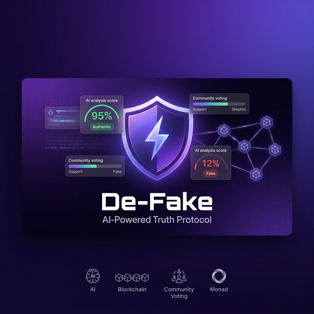

# 🛡️ De-Fake — AI-Powered Truth Protocol



**De-Fake** is a decentralized truth verification platform built on [Monad](https://monad.xyz). It combines **Google Gemini AI** analysis with **community-powered consensus** to fight misinformation on-chain.

Users post content → AI scores its authenticity → Community challenges & stakes → Truth wins.

## 🌐 Live Demo

**[de-fake.vercel.app](https://de-fake.vercel.app)**

## 🏆 Category

**AI × Social Infrastructure**

## ✨ Features

- 🤖 **AI-Powered Analysis** — Google Gemini 2.5 Flash analyzes every post for authenticity (0-100 score)
- ⚖️ **Stake-Based Voting** — Community members stake MON tokens to vote on challenged posts
- 💰 **Proportional Rewards** — Winners earn their stake back + proportional share of the losing pool
- 🔗 **Fully On-Chain** — All posts, scores, challenges, and votes are stored on Monad blockchain
- 🌓 **Dark/Light Theme** — Modern UI with smooth theme switching
- 🎨 **Premium Design** — Glassmorphism, micro-animations, and gradient accents

## 🏗️ Architecture

```
┌─────────────┐     ┌──────────────┐     ┌─────────────────┐
│   Frontend   │────▶│  Gemini AI   │     │  Monad Testnet  │
│  React/Vite  │     │  (Analysis)  │     │  (Smart Contract)│
│  + Tailwind  │────────────────────────▶│  DeFakeSocial   │
└─────────────┘                          └─────────────────┘
```

- **No backend required** — Gemini API is called directly from the frontend
- **No database required** — All data lives on-chain
- **Serverless deployment** — Hosted on Vercel with auto CI/CD

## 🔄 How It Works

1. **Post** — User writes content and clicks "Post to De-Fake"
2. **AI Analysis** — Google Gemini analyzes the text and assigns an authenticity score (0-100)
3. **On-Chain Storage** — Post + AI score are recorded on the Monad blockchain
4. **Challenge** — Any user can challenge a post by staking MON tokens
5. **Community Voting** — Others vote "Fake" or "Authentic" by staking MON
6. **Resolution** — After 24 hours, the majority side wins
7. **Rewards** — Winners claim their original stake + proportional share of the losing pool

### Reward Formula

```
reward = (your_stake × total_pool) / winning_side_total
```

**Example:** If you staked 2 MON on the winning side (total 5 MON), and the losing side had 3 MON:
- Total pool = 8 MON
- Your reward = (2 × 8) / 5 = **3.2 MON** (+1.2 MON profit)

## 🧠 AI Scoring Guidelines

| Score | Meaning |
|-------|---------|
| 85-100 | Clearly factual, verifiable information |
| 65-84 | Mostly credible with some opinions |
| 35-64 | Mixed credibility, exaggerated claims |
| 10-34 | Likely misleading or false |
| 0-9 | Obviously fabricated |

## 🛠️ Tech Stack

| Layer | Technology |
|-------|-----------|
| **Blockchain** | Monad Testnet (EVM-compatible L1) |
| **Smart Contract** | Solidity 0.8.24 |
| **AI** | Google Gemini 2.5 Flash Lite |
| **Frontend** | React 18 + TypeScript + Vite |
| **Styling** | Tailwind CSS v4 |
| **Wallet** | RainbowKit + wagmi + viem |
| **Deployment** | Vercel |

## 🚀 Getting Started

### Prerequisites

- Node.js 18+
- MetaMask with Monad Testnet configured

### Monad Testnet Configuration

| Setting | Value |
|---------|-------|
| Network Name | Monad Testnet |
| RPC URL | `https://testnet-rpc.monad.xyz` |
| Chain ID | 10143 |
| Symbol | MON |

### Installation

```bash
# Clone the repo
git clone https://github.com/your-username/defakee-monad-blitz-istanbul.git
cd defakee-monad-blitz-istanbul

# Install frontend dependencies
cd frontend
npm install

# Create environment file
echo "VITE_GEMINI_API_KEY=your_gemini_api_key_here" > .env

# Start development server
npm run dev
```

The app will be available at `http://localhost:5173`

### Smart Contract

The `DeFakeSocial` contract is deployed on Monad Testnet at:

```
0x6e6D526A73D70466B34561FB6C63d7a76123Fd56
```

To deploy a new instance, use [Remix IDE](https://remix.ethereum.org):
1. Paste `contracts/contracts/DeFakeSocial.sol`
2. Compile with Solidity 0.8.24
3. Deploy via Injected Provider (MetaMask on Monad Testnet)

## 📁 Project Structure

```
defakee-monad-blitz-istanbul/
├── frontend/                  # React frontend
│   ├── src/
│   │   ├── pages/
│   │   │   ├── FeedPage.tsx      # Main feed + composer
│   │   │   ├── ExplorePage.tsx   # Search & discover
│   │   │   └── ProfilePage.tsx   # User profile & stats
│   │   ├── Layout.tsx            # Sidebar navigation
│   │   ├── ThemeContext.tsx       # Dark/Light theme
│   │   ├── gemini.ts             # Gemini AI service
│   │   ├── abi.ts                # Smart contract ABI
│   │   └── index.css             # Design system & animations
│   └── .env                     # API keys (gitignored)
├── contracts/                 # Solidity smart contracts
│   └── contracts/
│       └── DeFakeSocial.sol      # Main contract
└── defake-banner.png          # Project banner
```

## 🤝 Why Monad?

- **Parallel Execution** — Handle hundreds of posts and votes concurrently
- **1-Second Finality** — Instant feedback for post creation and voting
- **Low Gas Fees** — Users can interact frequently without cost barriers
- **EVM Compatible** — Standard Solidity development, no new language needed
- **10,000+ TPS** — Scales to support a real social platform

## 📄 License

MIT

---

**Built for Monad Blitz Istanbul Hackathon 2026** ⚡
